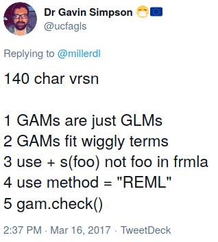

```{r setup, include=FALSE}
knitr::opts_chunk$set(echo = TRUE, 
                      comment = NA, # Required
                      fig.path = "./figures/",  # Store all figures here in relative path (make the folder first)
                      fig.align = "center",
                      fig.width = 7,
                      fig.height = 7,
                      message = FALSE, # Turn off load messages
                      warning = FALSE # Turn off warnings
                      )
```

## Generalized Additive Models

- Type of generalized linear model

- Response variable depends on smooth functions $f_i(x_i)$

- General structure of a GAM:
$$g(\operatorname {E} (Y))=\beta _{0}+f_{1}(x_{1})+f_{2}(x_{2})+\cdots +f_{n}(x_{n})$$

- Smooth functions can be many different things (polynomials, splines, weighted means, etc)
<!--
Stuff to include:
  - Background/history (1 slide)
  - Math derivation
  - When to use
  - Why to use (advantages/disadvantages over other models, etc)
-->

## Summations
A Linear Model sums the linear terms
$$y_i = \beta_0 +\sum_j { \beta_j x_{ji}} +\epsilon_i$$

GAMs sums the  _smooth functions_
$$y_i = \beta_0 + \sum_j {s_j(x_{ji})} + \epsilon_i$$
Where $$\epsilon_i \sim N(0, \sigma^2), y_i \sim \text{Normal}$$
<!-- When to use and why-->

## Splines
A _Spline_ is a function made of up basis functions (the smoothing functions)

These simpler functions form a set of functions called the _basis_

When using a spline for GAMs, each basis function has a coefficient

The spline is formed by weighing the basis function coefficients and summing them at each value of $x$

## Wiggliness and Penalized fit
As in the same case with a polynomial regression of excess "wiggles" not constraining the "Wiggliness"
in the way that we penalize the fit in order to prevent overfitting

_W_ or wiggliness is defined by:
$$\int_{\mathbb{R}} [f^{\prime\prime}]^2 dx = \boldsymbol{\beta}^{\mathsf{T}}\mathbf{S}\boldsymbol{\beta} = \large{W}$$


## Constraining Wiggliness
We have to make wiggliness important by looking into the log-likelihood,
or the measure of closeness to the data

The term **smoothing operator** $\lambda$ defines the trade-off to find _spline_ coefficients to maximize
the penalized log-likelihood fit

$$ \mathcal{L}_p(\boldsymbol{\beta}) = \mathcal{L}(\boldsymbol{\beta}) - \frac{1}{2} \lambda\boldsymbol{\beta}^{\mathsf{T}}\mathbf{S}\boldsymbol{\beta}$$
or
$$\mathcal{L}_p = \log(\text{Likelihood})  - \lambda W$$

## Selecting smooth
There are multiple methods to choose from the right amount of wiggle, some are:
AIC, Mallow $\mathcal{C}_p$, Maximum Likelihood(ML), and Restricted Maximum Likelihood(REML).
The most commonly method is REML for it's numerical stability

There are two ways to optimize the given $\lambda$:

- Predictive: Reducing generalization error
- Bayesian: Using priors for basis coefficients

## Maximizing Wiggliness
In a regular regression, the degree of freedom typically equal the predictors in the model. In the case for GAMs,
we look at the smoothing _basis_ of size $k$ and consider that with **penalized** fitting, their parameters are limited. Thus,
the models _**effective**_ degrees of freedom (EDF) will not equal the size $k$

The models effective degrees of freedom are given by $\displaystyle \text{trace}(F)$ where F is the EDF matrix
$$\displaystyle F=(X^{T}WX+\sum _{j}\lambda _{j}S_{j})^{-1}X^{T}WX$$

## Generalized Additive Models in R
  - Two options for packages, mgcv and gam
  - mgcv is more commonly used and better supported
  
Smooth interactions in R

1. Bivariate smoothing
  - s(x, z, bs = 'tp')
2. Tensor products smoothing
  - te(x, z)

## Example - Simulated Data
\tiny
```{r}
library(mgcv)
set.seed(0)
sim_data <- gamSim(1, n = 400, dist="normal", scale=2)
head(sim_data)
```

## Example - Simulated Data
\tiny
```{r}
fit <- gam(y ~ s(x0) + s(x1) + s(x2) + s(x3), data = sim_data)
summary(fit)
```

## Example - Simulated Data
\tiny
```{r, fig.height = 4}
plot(fit, pages=1, residuals=TRUE)
```

## Example - Simulated Data
\tiny
```{r, fig.height=4.5}
gam.check(fit)
```

## Example - mtcars
<!-- Wrap pred terms in s() for splines with wigglieness controlled by k argument -->
\tiny
```{r}
data("mtcars")
mtcars_gam <- 
  gam(mpg ~ s(disp), data = mtcars, method = "REML")
summary(mtcars_gam)
```

## Example - mtcars 
\tiny
```{r, fig.height=4}
library(ggplot2)
ggplot(data = mtcars, aes(x = disp, y = mpg)) +
  theme_bw() + geom_point() +
  geom_smooth(method = "gam", formula = y ~ s(x)) 
```

## Example - mtcars 
\tiny
```{r, fig.height=4.5}
gam.check(mtcars_gam)
```

## Example - mtcars
```{r}
```

## Example - Health Data - Explaining Data Set

We will be demonstrating GAMs on heart-rate data from a subject training for the Ironman Triathlon in a sleep study (taken from a paper titled "Heart Rate Oscillations during Meditation"). More info including the source material can be found [here](https://physionet.org/content/meditation/1.0.0/). We will focus on a small snippet of the non-linear material.

## Example - Health Data - Data Cleaning
\tiny
```{r, fig.height=3.5}
library(ggplot2)
library(dplyr)

# Read dataset
i_df <- read.csv("./i9.csv", header = FALSE)
colnames(i_df) <- c("time", "hr")
i_df$time <- i_df$time - 42301.30
i_df <- i_df[ (i_df$time > 4000),]
i_df <- i_df[ !(i_df$hr > 80),]

p <- ggplot(i_df, aes(x=time, y=hr)) +
  geom_point() +
  labs(title = 'Heart-rate study of Ironman Triathlete',
       x = "Time", 
       y = "Heart-rate (beats-per-minute)") +
  ylim(45, 75)
```


## Example - Health Data - Yoga meditator
\tiny
```{r}
# Show case for Yoga meditator
```


## Example - Health Data - Chi meditator
\tiny
```{r}
# Show case for Chi meditator
```

## Example - Health Data - LM
\tiny
```{r, fig.height=3.5}
# Linear Model Fit (uses formula = y~x)
p + geom_smooth(method = 'lm', se=FALSE, color = 'blue')
```

```{r, fig.height=3.5}
# Model Fit adjusting splines
p + geom_smooth(method = 'lm', formula = y~splines::bs(x,3), se=FALSE, color = 'blue')
```


## Example - Health Data - Loess
\tiny
```{r, fig.height=3.5}
# Loess Model Fit 
p + stat_smooth(method = "loess", se = FALSE, span = 0.1,
                method.args = list(degree = 2), color = "blue", size = 1)
```

## Example - Health Data - GAM
\tiny
```{r, fig.height=3.5}
# GAM Model Fit (formula = y ~ s(x, bs = "cs"))
p + geom_smooth(method = 'gam', se=FALSE, color = 'red')
```

## Conclusion
- The benefits of implementing GAMs provides a flexible framework to accurately model nonlinear relationships.

- It's formed from basis functions, which weigh regression functions to form larger functions known as smooths

- To control overfitting, we penalize the fit of the model by adjusting the goodness of fit

<!-- 
Stuff to Include:
  - Furthur reading
  - Summary of useful libraries
-->
## Conclusion


## References
- https://m-clark.github.io/generalized-additive-models/introduction.html - Clark GAMs Tutorial

- https://fromthebottomoftheheap.net/slides/gam-intro-webinar-2020/gam-intro.html#1 - Simpson Intro to GAMs

- https://www.mrc-bsu.cam.ac.uk/wp-content/uploads/GAM_slides1.pdf - MRC BioStatistics AM & GAMs
