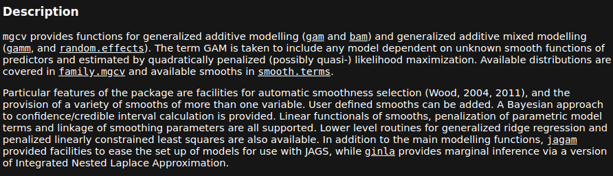

```{r setup, include=FALSE}
knitr::opts_chunk$set(echo = TRUE, 
                      comment = NA, # Required
                      fig.path = "./figures/",  # Store all figures here in relative path (make the folder first)
                      fig.align = "center",
                      fig.width = 7,
                      fig.height = 7,
                      message = FALSE, # Turn off load messages
                      warning = FALSE # Turn off warnings
                      )
```

## Generalized Additive Models
<!--
Stuff to include:
  - Background/history (1 slide)
  - Math derivation
  - When to use
  - Why to use (advantages/disadvantages over other models, etc)
-->


## Generalized Additive Models

- Type of generalized linear model
- Response variable depends on smooth functions $f_i(x_i)$
- General structure of a GAM:
$g(\operatorname {E} (Y))=\beta _{0}+f_{1}(x_{1})+f_{2}(x_{2})+\cdots +f_{n}(x_{n})$
- Smooth functions can be many different things (polynomials, splines, weighted means, etc)

## Generalized Additive Models
A Linear Model sums the linear terms
$$y_i = \beta_0 +\sum_j { \beta_j x_{ji}} +\epsilon_i$$

GAMs sums the  _smooth functions_
$$y_i = \beta_0 + \sum_j {s_j(x_{ji})} + \epsilon_i$$
where $$\epsilon_i \sim N(0, \sigma^2), y_i \sim \text{Normal}$$
<!-- When to use and why-->

## Generalized Additive Models
## Generalized Additive Models
## Generalized Additive Models
## Generalized Additive Models
## Generalized Additive Models
## Generalized Additive Models in R
  - Two options for packages, mgcv and gam
  - mgcv is more commonly used and better supported


## Example - Simulated Data
\tiny
```{r}
library(mgcv)
set.seed(0)
sim_data <- gamSim(1, n = 400, dist="normal", scale=2)
head(sim_data)
```

## Example - Simulated Data
\tiny
```{r}
fit <- gam(y ~ s(x0) + s(x1) + s(x2) + s(x3), data = sim_data)
summary(fit)
```

## Example - Simulated Data
\tiny
```{r, fig.height = 4}
plot(fit, pages=1, residuals=TRUE)
```

## Example - Simulated Data
\tiny
```{r, fig.height=4.5}
gam.check(fit)
```

## Example - mtcars
<!-- Wrap pred terms in s() for splines with wigglieness controlled by k argument -->
\tiny
```{r}
data("mtcars")
mtcars_gam <- 
  gam(mpg ~ s(disp), data = mtcars, method = "REML")
summary(mtcars_gam)
```

## Example - mtcars 
\tiny
```{r, fig.height=4}
library(ggplot2)
ggplot(data = mtcars, aes(x = disp, y = mpg)) +
  theme_bw() + geom_point() +
  geom_smooth(method = "gam", formula = y ~ s(x)) 
```

## Example - mtcars 
\tiny
```{r, fig.height=4.5}
gam.check(mtcars_gam)
```
## Example - mtcars
```{r}
```

## Example - iris
\small
```{r}
data("iris")
```

## Example - iris
## Example - iris 
## Example - iris 

## Example - Health Data
```{r}
# df <- read.csv('health_data.csv')
 # show the data
```
## Example - Health Data
## Example - Health Data
## Example - Health Data
## Example - Health Data
## Example - Health Data

## Conclusion
<!-- 
Stuff to Include:
  - Furthur reading
  - Summary of useful libraries
-->
## Conclusion
## Conclusion

## References
